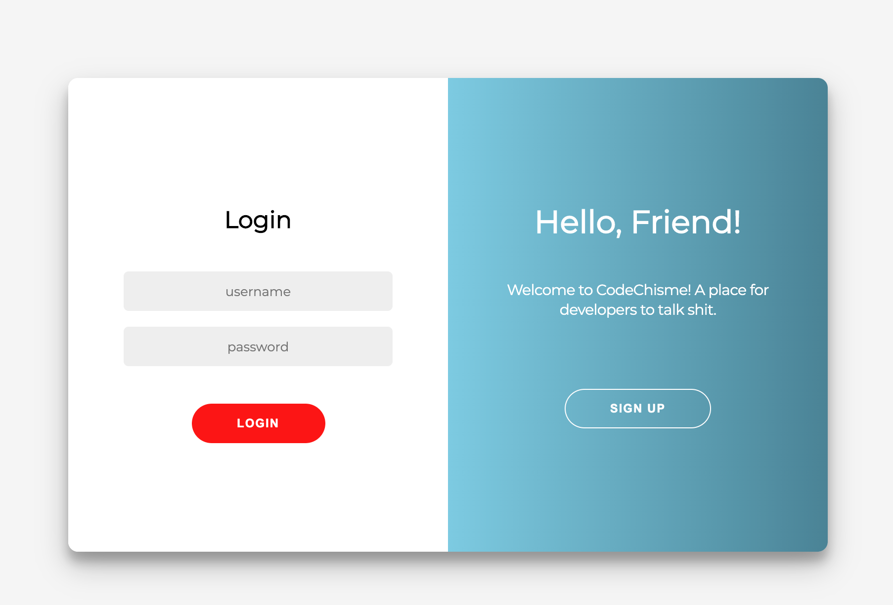
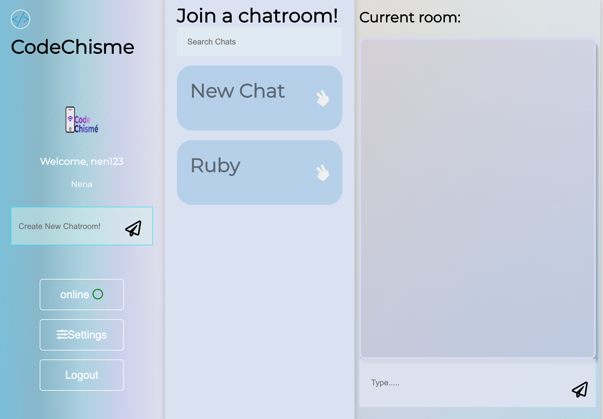

This project was bootstrapped with [Create React App](https://github.com/facebook/create-react-app).

# Code Chisme 
 A social platform that facilitates communication among developers and the programming community alike.
 
## Description

 The term *Chisme* roughly translates to *tea*, or *gossip*, which can often be the fastest way to inform. With this in mind we devloped Code Chisme Using Websockets through Actioncable the app allows the user to create chatrooms pertaining to topics of programming. In addition to allowing realtime communication. User authentication is implemented through use of sessions and Bcrypt.
 
# Getting Started

 ## Prerequisites
 
  1. To clone and run this application, youll need Git and Node.js  
  2. Fork and Clone [CodeChisme BackEnd](https://github.com/21shield/chatupApp)
  3. Install [Node.js and NPM](https://www.npmjs.com/get-npm)
   `brew install node`
  4. Run '$ rails s' in the folder that contains the CodeChisme BackEnd
  
## Starting the Frontend Server

 1. Fork and Clone this repository and cd into directory
 2. Install all dependencies\
  `$ npm install`
 3. Start the Frontend server this should open a webpage for you if not go to http://localhost:3001 \
 `$ npm start`
 4. Type `$ y` or `$ yes` when prompted
 
## How To Use

  When first starting up the application you will need to sign up with an username email and password. To see websockets at work Open another Webpage under a diffrent account, make sure to. join the same chat room to see real time messaging. 

### Want to contribute?

Make a pull request in a diffrent branch and do not fork :D 

## Visuals

  
 Login Page 
 
    

  
 User Home Page 
 
    

## Contributing
Pull requests are welcome. For major changes, please open an issue first to discuss what you would like to change.

Please make sure to update tests as appropriate.\

[Go To Top](#Description)

